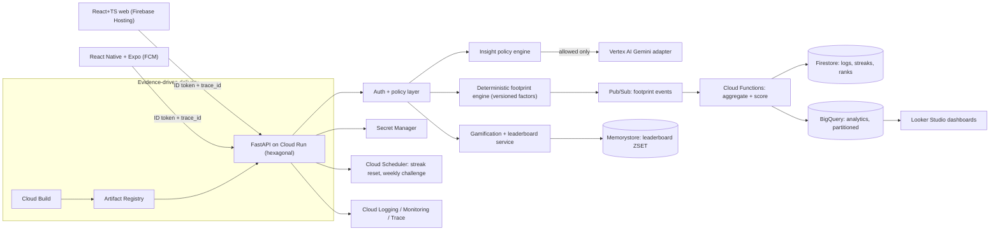

<!-- SPDX-License-Identifier: MIT -->

# Architecture

The Carbon Footprint Awareness Platform is a GCP-maximal, hexagonally layered
consumer product for **understanding, tracking, and reducing** everyday carbon
emissions. The runnable MVP is the web footprint calculator (transport domain)
plus a policy-gated Gemini "Sustainability Insights Agent"; the multi-domain
trackers, mobile app, gamification, and leaderboard are designed now and phased
as roadmap (see [`phases.md`](phases.md)).

## System overview

## Hexagonal layering (backend)

The backend (`backend/src/carbon/`) keeps pure domain logic free of I/O so it is
fully unit-testable, with all external systems behind ports (`typing.Protocol`).

| Layer | Path | Responsibility |
|-------|------|----------------|
| Domain | `domain/transport.py`, `domain/benchmarks.py`, `domain/factors.py`, `domain/registry.py`, `domain/trackers/*` | Pure, deterministic calculation; versioned emission factors; relatable benchmark cross-reference; pluggable `DomainTracker` port. |
| Application | `application/insights.py` (`gamification.py`, `leaderboard.py` are Phase 7-8 stubs) | Plan/Execute/Evaluate insight policy engine; rule-based-first, LLM phrasing-only. |
| Adapters | `adapters/gemini.py`, `adapters/firestore.py`, `adapters/bigquery.py`, `adapters/pubsub.py`, `adapters/leaderboard_store.py` | Vertex AI Gemini client (timeout/semaphore/retry/token cap), data-minimized Firestore write, aggregate-only BigQuery export, Pub/Sub publish, Memorystore ZSET port. |
| API | `api/routes.py`, `api/auth.py`, `api/errors.py`, `api/health.py`, `api/logging_middleware.py`, `api/rate_limit.py`, `api/container.py` | FastAPI transport: `POST /api/footprint`, Firebase auth dependency, typed error envelope, `/healthz` + `/readyz`, structured logging, per-uid rate limiting, DI container. |
| Core | `core/config.py`, `core/logging.py` | Typed `BaseSettings` (fail-fast, `SecretStr`), structured logging config. |

Composition root: `main.py:create_app` wires production GCP adapters via
`build_production_dependencies`; tests inject fakes through the same
`Dependencies` container.

## Request data flow (`POST /api/footprint`)

1. **Web/mobile client** attaches a Firebase **ID token** and an `X-Trace-Id`
   (`frontend/src/shared/api/client.ts`) and validates the request against the
   shared zod schema before sending.
2. **Structured logging middleware** (`api/logging_middleware.py`) assigns a
   `request_id`, derives a `trace_id` from the Cloud Trace header, and times the
   request. Bodies are never read or logged.
3. **CORS** is locked to configured origins — never `*` (`main.py`,
   `core/config.py:cors_allowed_origins`).
4. **Auth dependency** (`api/auth.py:require_uid`) verifies the Firebase ID
   token (signature, `aud`/`iss`, expiry) and injects `uid`; failures → 401
   envelope.
5. **Abuse controls** (`api/rate_limit.py`): request body-size cap (413) and
   per-uid sliding-window rate limit (429).
6. **Deterministic engine** (`domain/registry.py` → `domain/transport.py`)
   computes kg CO₂e from versioned factors (`data/emission_factors.json`,
   cached at module load via `domain/factors.py`).
7. **Insight policy engine** (`application/insights.py`): rule-based-first.
   Thin/zero data → ask-for-context (no LLM call). Otherwise it builds a
   deterministic template + benchmark; Gemini is invoked **only** for phrasing,
   and any output that fabricates a number or breaks tone is rejected and the
   deterministic template is used (`llm_used=false`).
8. **Best-effort side-effects**: data-minimized Firestore log write
   (`adapters/firestore.py`) and a Pub/Sub event (`adapters/pubsub.py`) for
   async aggregation. Both are wrapped so a failure never breaks the response.
9. **Typed response** (`models/schemas.py:FootprintResponse`) with `request_id`;
   the committed contract lives at [`openapi.json`](openapi.json).

## GCP / Google services (each mapped to a concrete use)

The target architecture touches 18 Google services. Services marked **MVP** are
exercised by the running app today; **roadmap** services are wired in config
and/or behind ports for Phases 6-9.

| # | Service | Concrete use | Where | Status |
|---|---------|--------------|-------|--------|
| 1 | **Cloud Run** | Serves the stateless FastAPI container, autoscaled by request load | `backend/Dockerfile`, `infra/cloudbuild.yaml` | MVP |
| 2 | **Vertex AI (Gemini)** | Phrasing-only LLM for empathetic insight copy; timeout/semaphore/retry/token-capped | `adapters/gemini.py` | MVP |
| 3 | **Firebase Authentication** | Verifies user ID tokens server-side; injects `uid` | `api/auth.py` | MVP |
| 4 | **Cloud Firestore** | Data-minimized per-user footprint logs (and roadmap streaks/ranks) | `adapters/firestore.py`, `infra/terraform/main.tf` | MVP |
| 5 | **Pub/Sub** | Decouples the write path; emits footprint events for async aggregation | `adapters/pubsub.py`, `infra/terraform/main.tf` | MVP |
| 6 | **BigQuery** | Aggregate-only analytics export (no raw user text), partitioned by date | `adapters/bigquery.py`, `infra/terraform/main.tf` | MVP |
| 7 | **Secret Manager** | Holds credentials; SA has `secretmanager.secretAccessor` only | `core/config.py` (`SecretStr`), `infra/terraform/main.tf` | MVP |
| 8 | **Cloud Build** | CI/CD build of the container image | `infra/cloudbuild.yaml` | MVP |
| 9 | **Artifact Registry** | Stores the built container image consumed by Cloud Run | `infra/cloudbuild.yaml` | MVP |
| 10 | **Cloud Logging / Monitoring / Trace** | Structured access logs + `trace_id` propagation for SLOs | `api/logging_middleware.py`, `core/logging.py` | MVP |
| 11 | **Firebase Hosting** | Serves the built Vite web app; the only allowed CORS origin in prod | `frontend/firebase.json`, `core/config.py` | MVP |
| 12 | **Cloud Functions** | Idempotent consumer aggregating footprint events → Firestore/BigQuery | `functions/aggregate_consumer.py` (Phase 7 contract) | Roadmap |
| 13 | **Memorystore (Redis)** | Leaderboard sorted-set for O(log n) rank updates/reads | `adapters/leaderboard_store.py` (Phase 8 port) | Roadmap |
| 14 | **Cloud Scheduler** | Streak reset + weekly-challenge reset triggers | designed in `phases.md` (Phase 8) | Roadmap |
| 15 | **Looker Studio** | Dashboards over the BigQuery analytics dataset | designed (BigQuery dataset exists) | Roadmap |
| 16 | **Firebase Cloud Messaging (FCM)** | Behavior-change nudges on mobile | `mobile/` (Phase 9) | Roadmap |
| 17 | **Google Fit API** | Opt-in active-minutes/step capture to assist transport logging | `mobile/` (Phase 9, consented) | Roadmap |
| 18 | **Google Maps Platform** | Opt-in trip-distance capture for transport logging | `mobile/` (Phase 9, consented) | Roadmap |

## Scalability & resilience

- **Stateless Cloud Run** autoscaled by load; session/durable state lives in
  Firestore/Memorystore, not in the process.
- **Decoupled write path**: footprint events go to Pub/Sub
  (`adapters/pubsub.py`) so spikes in analytics/leaderboard work never block the
  user request; consumers are designed idempotent (dedupe on `event_id`, see
  `functions/aggregate_consumer.py`).
- **Leaderboard** uses a Memorystore ZSET (O(log n) updates/range reads) with a
  periodic durable Firestore snapshot, instead of expensive Firestore fan-out.
- **Read scaling**: denormalized Firestore aggregates for single-doc dashboard
  reads; BigQuery (date-partitioned) for heavy analytics.
- **Cost/efficiency**: factors cached at module load; Gemini called only when
  the policy engine allows it, with bounded concurrency, an 8 s timeout, two
  retries with exponential backoff, and a 512-token output cap.
- **Observability/SLOs**: `trace_id` propagates web → API → (Gemini/functions);
  one structured access log per request carries `latency_ms`, `route`,
  `status`, `llm_used`, and `gemini_latency_ms` for latency/error SLOs.
